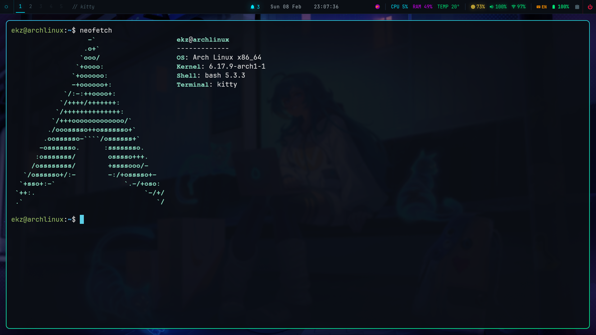
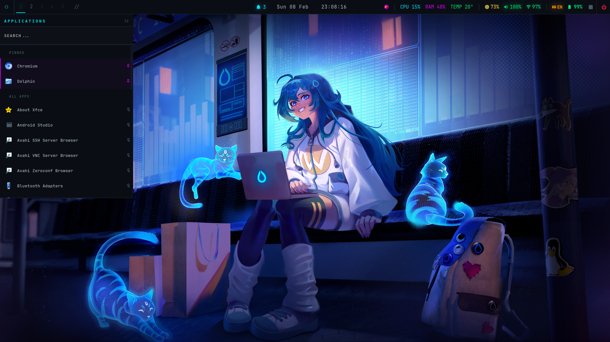
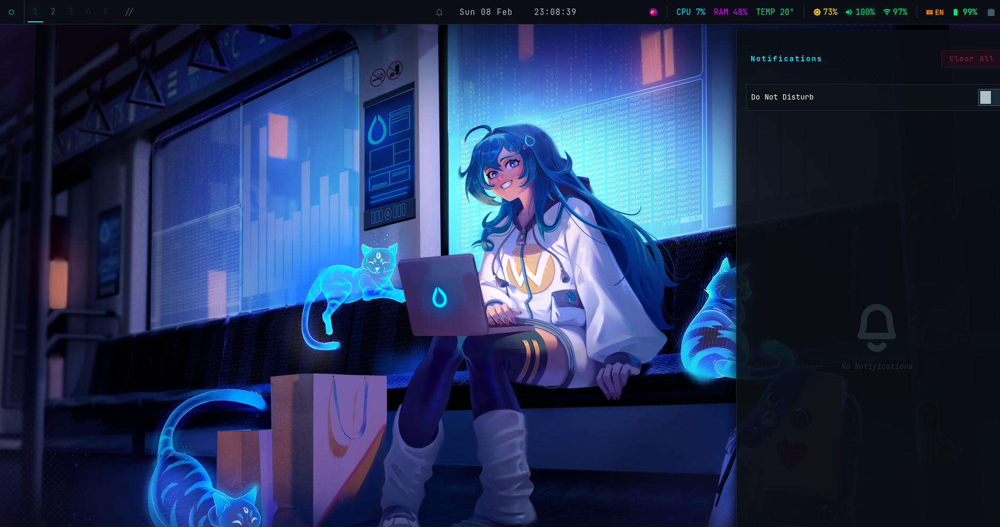
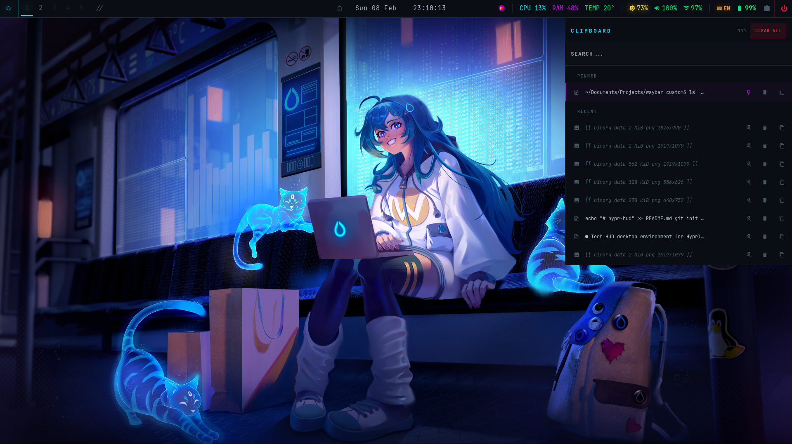

# Tech HUD — Waybar + SwayNC + Wofi + Clipboard Manager

Sci-fi inspired desktop environment theme for Hyprland.

Dark background, cyan/color-coded indicators, glow animations, sharp edges.

## Preview










## Dependencies

```bash
pacman -S waybar swaync wofi jq brightnessctl playerctl wl-clipboard cliphist python-gobject gtk-layer-shell
```

Font: [JetBrainsMono Nerd Font](https://www.nerdfonts.com/)

```bash
pacman -S ttf-jetbrains-mono-nerd
```

## Installation

```bash
# Backup existing configs
cp -r ~/.config/waybar ~/.config/waybar.bak
cp -r ~/.config/swaync ~/.config/swaync.bak
cp -r ~/.config/wofi ~/.config/wofi.bak

# Install waybar
cp waybar/config ~/.config/waybar/config
cp waybar/style.css ~/.config/waybar/style.css
mkdir -p ~/.config/waybar/scripts
cp waybar/scripts/* ~/.config/waybar/scripts/
chmod +x ~/.config/waybar/scripts/*.sh
chmod +x ~/.config/waybar/scripts/*.py

# Install swaync theme
cp swaync/config.json ~/.config/swaync/config.json
cp swaync/style.css ~/.config/swaync/style.css

# Install wofi theme
cp wofi/config ~/.config/wofi/config
cp wofi/style.css ~/.config/wofi/style.css

# Restart services
killall waybar; waybar &
swaync-client -rs
```

## Structure

```
waybar/
├── config                          # Bar modules and settings
├── style.css                       # Tech HUD theme (GTK CSS)
└── scripts/
    ├── launcher-ui.py              # GTK3 app launcher with pin support
    ├── launcher-ui.css             # App launcher styling
    ├── power-ui.py                 # GTK3 power menu (shutdown/reboot/suspend/logout)
    ├── power-ui.css                # Power menu styling
    ├── clipboard-ui.py             # GTK3 clipboard manager with pin/delete
    ├── clipboard-ui.css            # Clipboard manager styling
    └── notification-count.sh       # Notification badge with unread count
wofi/
├── config                          # Wofi launcher settings
└── style.css                       # Tech HUD wofi theme
swaync/
├── config.json                     # Notification center settings
└── style.css                       # Tech HUD notification theme
```

## Features

**Waybar**
- Color-coded system indicators (CPU, RAM, temp, network, battery)
- Nerd Font icons with animated glow effects
- Notification badge with live unread count
- Workspaces with active indicator underline
- Active window class display

**App Launcher** (custom GTK3 app)
- Reads .desktop files, shows icons + names
- Pin/unpin favorite apps (persistent)
- Search/filter
- Toggle open/close from waybar hexagon button

**Clipboard Manager** (custom GTK3 app)
- Pin/unpin entries (persistent across sessions)
- Delete individual entries or clear all
- Search/filter
- Binary data detection (images shown as icons)
- Toggle open/close from waybar button
- Layer-shell popup anchored to top-right

**Power Menu** (custom GTK3 app)
- Shutdown / Reboot / Suspend / Logout
- Color-coded hover states per action
- Toggle open/close from waybar button
- Layer-shell popup anchored to top-right

**Wofi Launcher**
- Matching Tech HUD dark theme
- Cyan accent on selected entry
- Application icons support

**SwayNC Notifications**
- Urgency-based left border colors (dim/cyan/red)
- Matching dark background and sharp edges

## Customization

Colors are defined as CSS variables at the top of each `style.css`:

| Variable   | Default   | Used for                  |
|------------|-----------|---------------------------|
| `@accent`  | `#00e5ff` | Primary highlights, cyan  |
| `@green`   | `#00e676` | Network, volume, battery  |
| `@magenta` | `#d500f9` | Memory, MPRIS             |
| `@yellow`  | `#ffd740` | Backlight, battery warn   |
| `@red`     | `#ff1744` | Critical states, power    |
| `@orange`  | `#ff9100` | Language indicator         |

## Hyprland

Add to `~/.config/hypr/hyprland.conf`:

```
exec-once = waybar
exec-once = swaync
exec-once = wl-paste --type text --watch cliphist store
exec-once = wl-paste --type image --watch cliphist store
```
